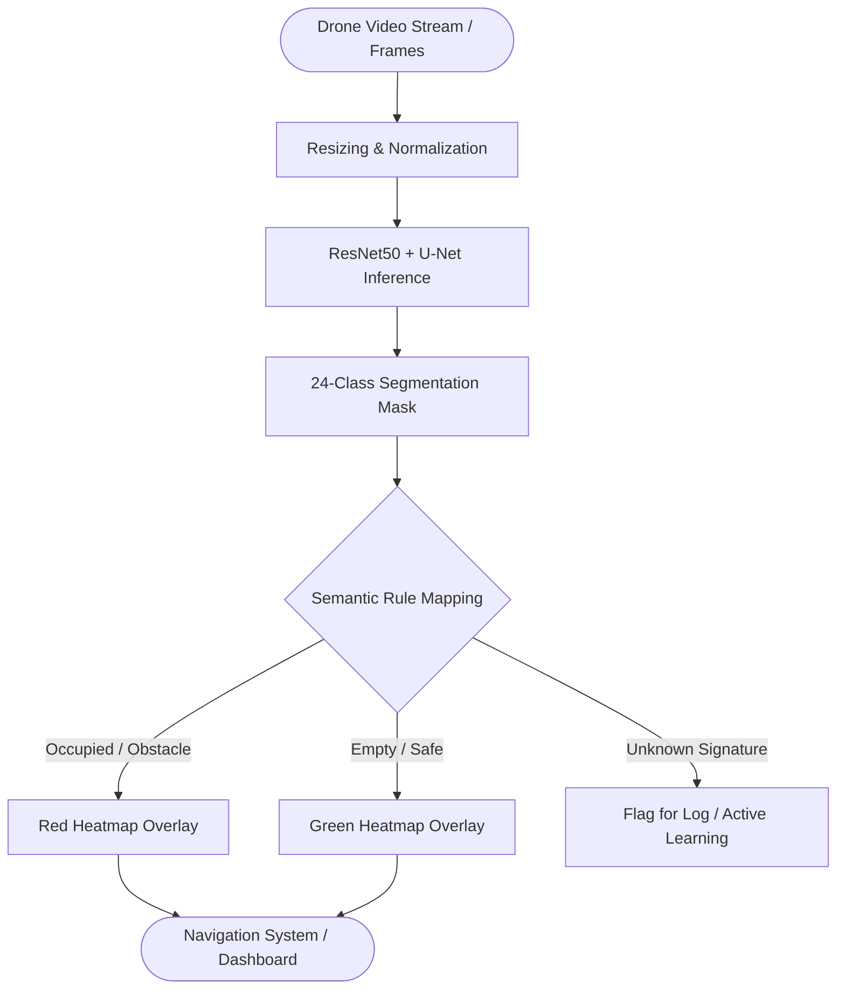

# Safe Landing Zone Detection (SLZ / SLAD) — Research & Operational Design

**Purpose**: A production-oriented whitepaper describing a Safe Landing Zone / Safe Landing Area Detection (SLZ/SLAD) feature built on semantic segmentation of drone imagery. This document presents the research findings from our baseline models, evaluates the inputs, outputs, and results, and defines the operational workflow, dataset requirements, and the future course of action for field deployment.

## Executive summary

- Goal: Provide a software feature that processes captured drone imagery to produce a heatmap indicating safe (empty, flat) vs unsafe (occupied, obstacle) terrain. Untagged/undefined regions are treated as empty by default, but unidentified entities are systematically captured for continuous model improvement.
- Application Metric: Target 4,000+ aerial images for sufficient environment coverage (diverse terrains, seasons, lighting). Unlabeled data will be pipelined for semi-automated annotation.
- Evaluated Method: Semantic segmentation (pixel-wise classification) utilizing a **_ResNet50 encoder and U-Net decoder architecture_**, successfully evaluated on aerial drone datasets.

## 1. Feature definition

- Feature: SLZ mapping — given a drone frame (RGB), return a heatmap overlay (per-pixel occupancy score) and a binary occupancy map (0 = empty, 1 = occupied).
- User story: "During drone flight operations, the SLZ feature highlights candidate landing zones in green and unsafe regions in red; any unrecognized object is flagged for review and integrated into the training loop."

## 2. Inputs and outputs (formal)

Model input (runtime):

```json
{
	"frame_id": "string",
	"timestamp": "ISO8601",
	"image": "H x W x 3 RGB array (uint8)",
	"gps": {"lat": float, "lon": float, "alt": float}
}
```

Model outputs (runtime):

```json
{
	"segmentation_mask": "H' x W' integer class IDs",
	"occupancy_mask": "H' x W' binary (0 empty, 1 occupied)",
	"heatmap": "H' x W' float [0..1] occupancy confidence",
	"metadata": {"inference_time_ms": int, "model_version": "vX"}
}
```

Notes:

- `H' x W'` is the model input resolution (differing from raw captured resolution to match encoder requirements). Our baseline evaluation utilized 416×608 dimensions; production frameworks will make this fully configurable based on the chosen deployment hardware.

# Production Image Processing Requirements

The proof-of-concept model was trained using images resized to 416 × 608 resolution.

However, drone cameras may generate imagery in varying formats and resolutions including:

- 1280 × 720
- 1920 × 1080
- 4K video frames
- RAW imagery

To ensure consistency between training and deployment, all incoming images must pass through a preprocessing layer before inference.

Recommended preprocessing steps:

1. RGB conversion and color validation.
2. Aspect-ratio preserving resize.
3. Padding or letterboxing to target resolution.
4. Pixel normalization.
5. Input tensor generation.

Example:

Drone Frame

↓

Preprocessing Pipeline

↓

416 × 608 Input Tensor

↓

Segmentation Model

This preprocessing layer ensures that the model receives data in the same format used during training.

## 3. Mapping rule (tagged vs untagged)

- Principle: Classes explicitly present in the dataset taxonomy are treated as "occupied" when their semantic label is in the occupied list (trees, vehicles, people, buildings, water, obstacles). All other classes can be treated as "empty" unless explicitly mapped otherwise.
- Default operational rule: if a pixel belongs to a known-occupied class -> occupancy=1. If pixel is unlabeled or mapped to an empty class (dirt, gravel, short grass, open terrain) -> occupancy=0. If model confidence is low or an unknown/unseen color/class appears, flag the frame for review (active learning).

## 4. Minimal dataset & annotation policy

- Goal: Achieve a robust baseline with 4,000 labeled aerial images; scaling to 8,000–12,000+ for high reliability across varying seasons, terrains, and altitudes.
- Diversity: urban, rural, agricultural, water bodies, roads, sparse trees, dense vegetation, construction sites, vehicles, people, and temporary objects.
- Annotation scheme: pixel-wise semantic masks (single-channel integer masks). Maintain a `class_dict.csv` mapping with columns: `id,name,r,g,b` (id is the integer label used by the model; r,g,b used for color-coded masks).

If dataset is unlabeled:

1. Triage/collect raw imagery.
2. Use semi-automatic labeling (Tile-based labelling, weak supervision, or tools such as Labelbox/LabelMe/Roboflow) to produce initial masks.
3. Create a QA pass: sample tiles and correct errors.
4. Produce a final single-channel mask dataset and class mapping file.

## 5. Preprocessing pipeline (production-ready)

Goals: deterministic, configurable, and robust to varying input sizes, formats, and colors.

Steps:

1. Input normalization:
   - Convert to RGB if needed.
   - Validate EXIF orientation.
2. Resize and letterbox/pad to target model resolution (configurable, e.g., 416×608). Prefer preserving aspect ratio + padding to avoid distortion.
3. Color normalization: scale to [0,1] float or mean/std normalization consistent with training.
4. Class mapping for masks: convert RGB masks to single-channel integer masks using `class_dict.csv`.
5. Data augmentation (training only): random crops, rotations, brightness/contrast jitter, blur, small-scale noise, and simulated shadows to improve robustness.
6. Batch & TFRecord/LMDB packaging for efficient training (optional).

Example tools and commands:

Use `ffmpeg` or `opencv` for resizing in batch. Example FFmpeg command to resize and pad while preserving aspect ratio:

```bash
ffmpeg -i input.jpg -vf "scale=iw*min(608/iw\,416/ih):ih*min(608/iw\,416/ih),pad=608:416:(608-iw*min(608/iw\,416/ih))/2:(416-ih*min(608/iw\,416/ih))/2" output.jpg
```

# Experimental Evaluation & Findings

As part of the initial proof-of-concept, a semantic segmentation pipeline based on a ResNet50 encoder and U-Net decoder architecture was evaluated using the Semantic Drone Dataset.

## Objective

The objective of this evaluation was to determine whether semantic segmentation could be used to distinguish occupied terrain from empty terrain and provide a foundation for Safe Landing Zone (SLZ) identification.

## Training Configuration

Model:

- ResNet50_UNet

Dataset:

- Semantic Drone Dataset

Input Resolution:

- 416 × 608 RGB Images

Number of Classes:

- 24 Semantic Classes

Training Environment:

- Kaggle Notebook Environment

## Generated Artifacts

Training produced the following model checkpoints:

- resnet50_unet.0
- resnet50_unet.1
- resnet50_unet.2
- resnet50_unet.3
- resnet50_unet.4

Additionally:

- resnet50_unet_config.json

was generated containing model configuration metadata.

The final checkpoint represents the latest trained model candidate for evaluation.

## Inference Validation

The trained model was executed against validation imagery.

Observed inference output:

Output Shape:
(208,304)

Example Output:

[[0,0,0,...],
[0,1,13,...],
[0,9,9,...]]

The output is a pixel-wise segmentation mask.

Each pixel contains a semantic class identifier.

Example:

out[100][150] = 9

indicates that pixel (100,150) belongs to semantic class 9.

## Key Observation

The model does not output semantic labels directly.

Instead, it produces a matrix of class identifiers.

A class-mapping layer is therefore required to convert:

4 → grass

9 → vegetation

20 → tree

etc.

into human-readable labels.

## Conclusion

The experiment successfully demonstrated that aerial imagery can be transformed into semantic terrain representations.

These semantic representations can subsequently be converted into occupancy maps and Safe Landing Zone visualizations.

## 6. Experimental Results to Operational Use

- Experimental notebooks (`deep-learning-based-semantic-segmentation-keras.ipynb` and RGB preprocessing scripts) demonstrated the successful extraction of spatial features using a ResNet50 encoder combined with a U-Net decoder. The model was evaluated on a 24-class Semantic Dataset, effectively translating raw RGB masks into operational segmentation outputs.
- Evaluated Results: The model reliably isolated distinct semantic elements (vegetation, vehicles, built infrastructure). Converting categorical segmentation predictions into binary safety arrays (safe/unsafe) proved to be a highly effective strategy for programmatic landing zone determination.
- Operational Transition: Ensure model portability (e.g., via ONNX or TFLite) for edge-deployment. Abstract the RGB-to-Class index conversion to handle new and unknown environment colors systematically within the runtime framework.

---

### Core Execution Workflow



---

## Dataset requirements & inventory

Minimum dataset target: 4,000 labeled aerial images. Recommended: 8,000–12,000 for improved generalization.

Suggested per-class guidance (example canonical label set):

| Class (example)                 | Recommended labelled pixels / images | Notes                                           |
| ------------------------------- | -----------------------------------: | ----------------------------------------------- |
| Open terrain / dirt             |                         1500+ images | Include varied seasons and lighting             |
| Short grass / gravel            |                         1200+ images | Different grass heights and mowing states       |
| Trees / vegetation              |                         2500+ images | Dense and sparse coverage                       |
| Buildings / roofs               |                         1000+ images | Urban/rural balance                             |
| Roads / paved area              |                         1000+ images | Include occlusions, shadows                     |
| Water bodies                    |                          500+ images | Lakes, ponds, flooded fields                    |
| Vehicles                        |                          800+ images | Parked and moving, occluded examples            |
| People                          |                          500+ images | Safety-critical class — prioritize precision    |
| Temporary obstacles / equipment |                          400+ images | Hard-to-predict objects — annotate aggressively |

Annotation QA rules:

- Use tile-based review: randomly sample tiles from each class for manual QA.
- Track per-annotator IoU against gold-standard tiles; require annotator IoU > 0.85 before bulk annotation.
- Maintain an "unknown-colors" log from RGB masks to capture unseen colors for review.

---

## 7. Unknown Entity Handling

Real-world environments may contain objects or terrain classes not present in the original training dataset.

Examples:

- Agricultural machinery
- Construction equipment
- Temporary structures
- Previously unseen terrain categories

When a previously unseen object is encountered:

1. The frame is flagged.
2. The image and segmentation output are stored.
3. The sample enters an annotation queue.
4. Human review determines the correct label.
5. The dataset is expanded.
6. The model is fine-tuned and redeployed.

Until reviewed, unknown entities should be treated as requiring operator attention rather than automatically classified as safe terrain.

This process establishes a continuous active-learning workflow and enables long-term model improvement.

## 8. Model inputs/outputs & evaluation metrics

- Inputs: preprocessed RGB frames at configured resolution.
- Outputs: integer segmentation masks, occupancy masks, and softmax-based per-pixel confidence heatmaps.

Metrics for model validation:

- Mean Intersection over Union (mIoU) across classes.
- Precision/Recall for the binary occupancy map (treating occupied vs empty).
- F1-score and Average Precision (AP) for obstacle detection classes.
- Per-class IoU for safety-critical classes (person, water, vehicle, building, tree).

Thresholding:

- Convert class predictions to occupancy with a per-class occupancy flag (configurable list of occupied classes) and an optional confidence threshold to suppress low-confidence detections.

## 9. Recommended public datasets & resources

- Semantic Drone Dataset (PoC dataset) — good PoC, 24 classes, RGB color masks + class CSV.
- UAVid — UAV dataset with dense annotations.
- ISPRS Potsdam & Vaihingen — high-resolution aerial imagery with semantic labels.
- LoveDA — landcover dataset, good for domain adaptation.
- LandCover.ai — high-resolution tiling for urban/rural scenes.
- AeroScapes — UAV semantic segmentation dataset.

Practical approach: combine several datasets and standardize the class set. If required classes are absent, add them via annotation and map to your canonical `class_dict.csv`.

## 10. Deliverables to push to repository (recommended structure)

- `docs/Drone-Imagery-Classification.md` (this document)
- `data/class_dict.csv` (canonical mapping)
- `data/sample_images/` (50–200 example frames demonstrating classes)
- `preprocess.py` (standalone RGB->mask and image preprocessing)
- `train.py` and `config.yaml` (training entrypoint and hyperparameters)
- `infer.py` (inference and heatmap exporter)
- `notebooks/` (PoC notebook with pointers to extracted scripts)
- `README.md` (how to run preprocessing, training, inference; minimal system requirements)
- `evaluation.md` (validation procedure and metrics)

# Current Limitations

The current proof-of-concept identifies terrain occupancy through semantic segmentation.

The system currently evaluates:

- Occupied regions
- Empty regions
- Terrain semantics

The system does not currently evaluate:

- Surface slope
- Terrain roughness
- Ground stability
- Landing dynamics
- Weather conditions

Therefore the current output should be interpreted as:

"Potential Empty Terrain"

rather than a fully validated Safe Landing Zone.

Additional sensing and terrain analysis modules may be incorporated in future iterations.

## 11. Recommended next steps (for your PM)

1. Confirm canonical class list and occupied-versus-empty mapping.
1. Aggregate / collect raw imagery (target >= 4,000 images) and budget annotation resources.
1. Convert the PoC notebook cells into modular scripts and create a basic CI job to validate preprocessing.
1. Run an initial training job on company hardware using the prepared dataset; evaluate mIoU and binary occupancy metrics.
1. Set up a review queue (database + UI or simple CSV) for active-learning flagged frames.

Appendix A — Example `class_dict.csv`

| id  | name       | r   | g   | b   |
| --- | ---------- | --- | --- | --- |
| 0   | unlabeled  | 0   | 0   | 0   |
| 1   | paved-area | 128 | 64  | 128 |
| 2   | dirt       | 130 | 76  | 0   |
| 3   | grass      | 0   | 102 | 0   |
| ..  | ...        | ... | ... | ... |

Appendix B — RGB -> single-channel mapping outline (pseudo)

1. Read `class_dict.csv` into memory and build a map from (r,g,b) -> id.
2. For each RGB mask image, create a single-channel array `mask = zeros(H,W)`.
3. For each pixel (i,j), read `(r,g,b)`, look up id; if not found, set id=0 (unlabeled) and record the color in an "unknown colors" log.
4. Save `mask` as PNG (uint8 or uint16 depending on number of classes).

Appendix C — Minimal config options (example `config.yaml`)

```yaml
model:
	backbone: resnet50
	input_size: [416,608]
	num_classes: 24

training:
	batch_size: 8
	epochs: 50
	lr: 1e-4

preprocessing:
	resize_mode: letterbox
	augment: true

occupied_classes: ["person","vehicle","building","tree","water","obstacle"]
```

---
